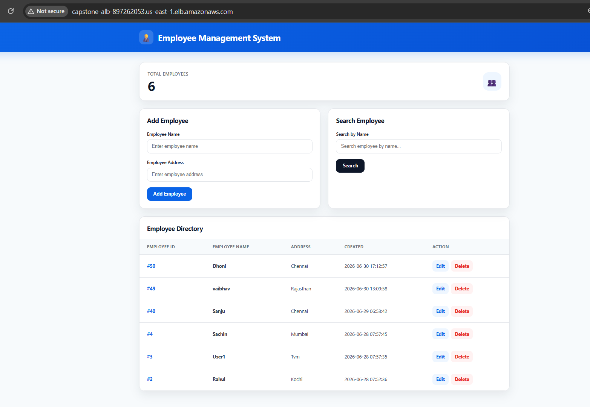
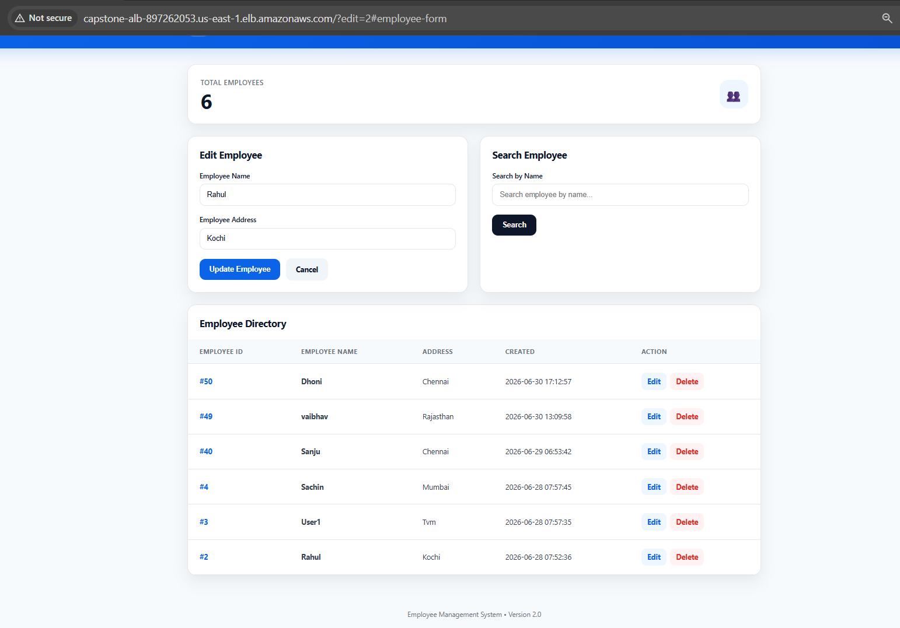

# AWS Employee Management Application



## Overview

The **AWS Employee Management Application** is a PHP and MySQL employee directory deployed on AWS with an automated CI/CD pipeline.

This project demonstrates both application development and DevOps delivery:

- PHP employee management application
- Amazon RDS MySQL database integration
- GitHub Actions CI/CD pipeline
- S3-based deployment artifact storage
- AWS Systems Manager deployment to EC2 instances
- Release-based deployments with rollback support
- Application Load Balancer in front of an Auto Scaling Group
- CloudWatch monitoring and alarms

> Cost note: the live AWS environment may be stopped or deleted after documentation to avoid ongoing AWS Free Tier usage. Screenshots and documentation are included so the project remains reviewable when the infrastructure is offline.

## Features

- Add employee records
- View employee directory
- Search employees by name
- Edit employee name and address
- Delete employee records
- Health check endpoint for deployment verification
- Release-based deployment under `/opt/employee-app`

## Latest Release

| Item | Value |
| --- | --- |
| Application version | `v3.0.0` |
| Latest runtime fix commit | `22258c7` |
| Employee edit feature commit | `25d9f90` |
| Region | `us-east-1` |
| Auto Scaling Group | `capstone-asg` |
| Artifact bucket | `rahulmt007-employee-management-artifacts` |

## Screenshots

### Application



### Architecture


### GitHub Actions


### AWS Resources

| Resource | Screenshot |
| --- | --- |
| Application Load Balancer | [alb.png](screenshots/aws/alb.png) |
| Auto Scaling Group | [asg.png](screenshots/aws/asg.png) |
| EC2 Instances | [instances.png](screenshots/aws/instances.png) |
| RDS MySQL | [rds.png](screenshots/aws/rds.png) |
| S3 Artifact Bucket | [s3.png](screenshots/aws/s3.png) |
| Launch Template | [launch template.png](screenshots/aws/launch%20template.png) |
| IAM | [IAM.png](screenshots/aws/IAM.png) |
| VPC | [vpc.png](screenshots/aws/vpc.png) |
| CloudWatch Dashboard | [dashboard.png](screenshots/monitoring/dashboard.png) |
| CloudWatch Alarm | [alarm.png](screenshots/monitoring/alarm.png) |

## Architecture

```text
Developer
  |
  v
GitHub Repository
  |
  v
GitHub Actions
  |
  +--> Build deployment artifact
  |
  +--> Upload artifact to Amazon S3
  |
  +--> Discover InService EC2 instances in Auto Scaling Group
  |
  +--> Send AWS Systems Manager command
          |
          v
       EC2 Instances
       Apache + PHP + PHP-FPM
          |
          v
       /opt/employee-app/current
          |
          v
Application Load Balancer
  |
  v
End Users
  |
  v
Amazon RDS MySQL
```

## AWS Services Used

| Service | Purpose |
| --- | --- |
| Amazon EC2 | Hosts Apache and PHP application runtime |
| Auto Scaling Group | Replaces unhealthy instances and supports scaling |
| Application Load Balancer | Routes user traffic to healthy EC2 instances |
| Amazon RDS MySQL | Stores employee data |
| Amazon S3 | Stores deployment artifacts |
| AWS Systems Manager | Runs deployment commands without SSH |
| AWS IAM | Controls EC2, S3, SSM, and GitHub Actions permissions |
| Amazon CloudWatch | Provides dashboard, metrics, and alarms |
| Amazon SNS | Sends alarm notifications |
| GitHub Actions | Builds, uploads, and deploys application releases |

## CI/CD Pipeline

The workflow in `.github/workflows/deploy.yml` runs on pushes to `main` and can also be started manually.

```text
Push to main
  |
  v
Validate repository structure
  |
  v
Generate VERSION and manifest.json
  |
  v
Package app/ and scripts/ into a ZIP artifact
  |
  v
Upload artifact to GitHub Actions and Amazon S3
  |
  v
Find InService instances in capstone-asg
  |
  v
Verify instances are Online in SSM
  |
  v
Run bootstrap.sh and deploy.sh through SSM
  |
  v
Create release directory and update current symlink
  |
  v
Restart PHP-FPM and Apache
  |
  v
Verify http://localhost/healthcheck.php returns 200
```

## Release-Based Deployment

Application files are deployed to timestamped release directories:

```text
/opt/employee-app
|-- current -> releases/<active-release>
|-- releases/
|-- backups/
|-- logs/
`-- scripts/
```

Benefits:

- Fast rollback by repointing the `current` symlink
- Clear release history on each instance
- Safer deployments than overwriting files in place
- Health check verification before declaring success

## Important Operational Lessons

- Fresh Auto Scaling instances only run the EC2 bootstrap. The GitHub Actions deployment must run after instances are `InService` and `Online` in SSM.
- Seeing Apache's `It works!` page means the instance bootstrapped but the application deployment has not completed or Apache is not pointed at the app release.
- PHP output can remain stale if PHP-FPM is not restarted. The deployment now restarts PHP-FPM when available, then restarts Apache.
- The live ALB URL is useful for testing, but screenshots are the durable portfolio artifact once Free Tier resources are terminated.

## Documentation

- [Architecture](docs/architecture.md)
- [Deployment Guide](docs/deployment-guide.md)
- [Troubleshooting Guide](docs/troubleshooting.md)
- [AWS Teardown Guide](docs/aws-teardown.md)

## Repository Structure

```text
.
|-- .github/workflows/deploy.yml
|-- app/
|   |-- assets/
|   |-- sql/database.sql
|   |-- healthcheck.php
|   `-- index.php
|-- docs/
|-- infrastructure/userdata.sh
|-- scripts/
|-- screenshots/
`-- README.md
```

## Future Enhancements

- HTTPS using AWS Certificate Manager
- Route 53 DNS record
- GitHub OIDC instead of long-lived AWS access keys
- Terraform infrastructure as code
- Blue/green or rolling deployment strategy
- Prepared SQL statements and CSRF protection
- Docker containerization and ECS deployment

## Author

Rahul M  
GitHub: <https://github.com/rahulmt007>
